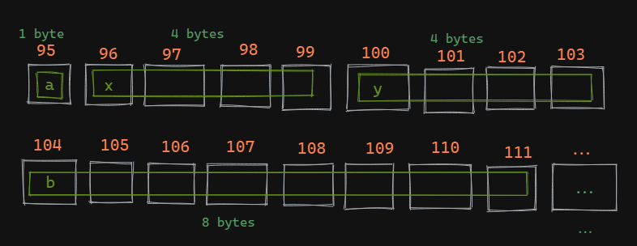
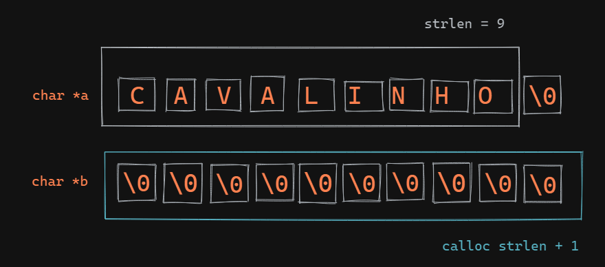
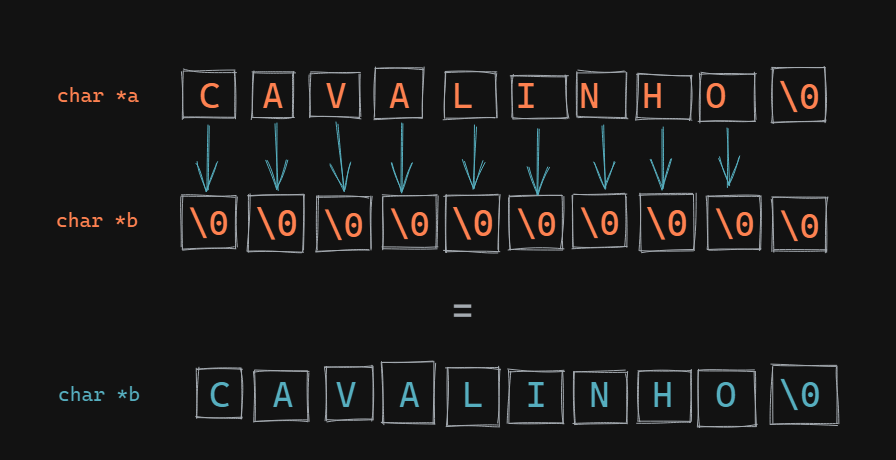
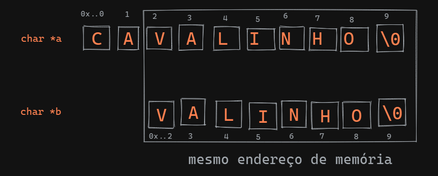
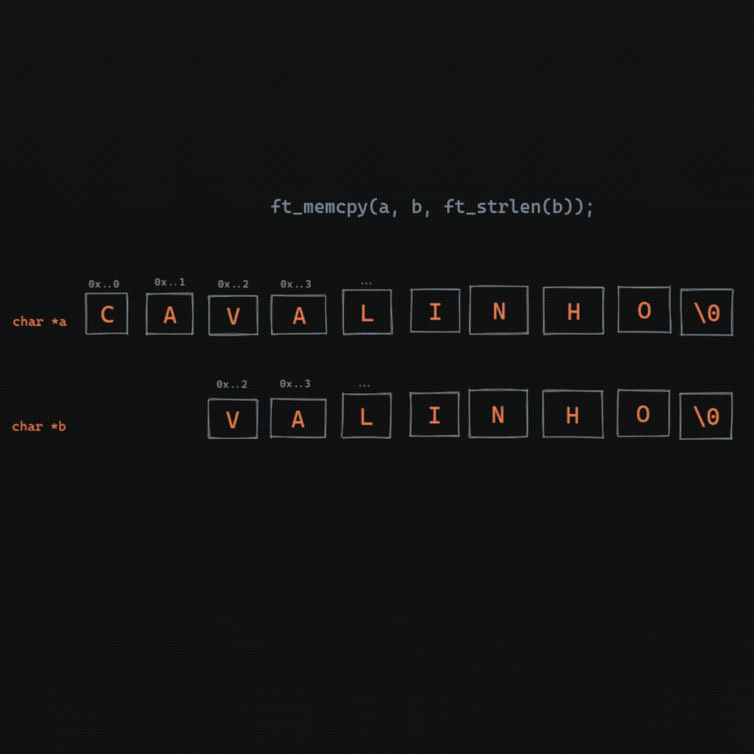
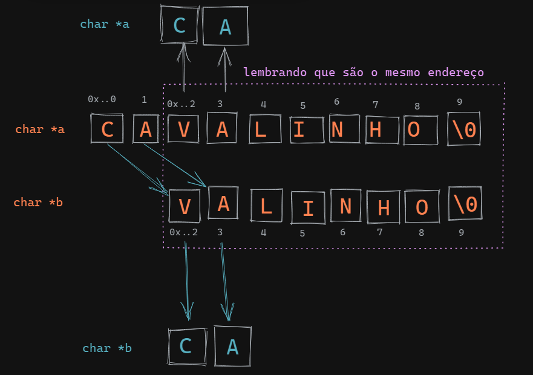
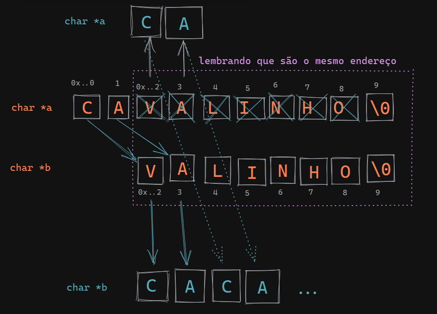
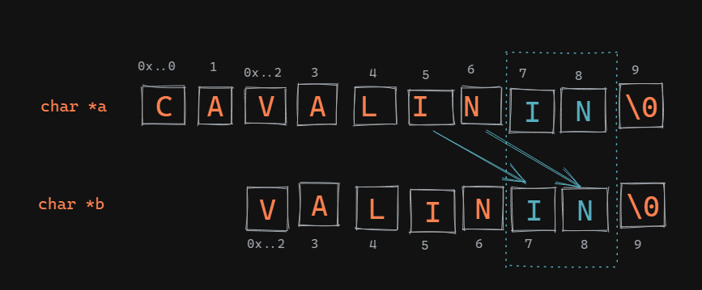

## Funções de manipulação de memória Pt 1 - memcpy vs memmove

Contexto: Logo no começo da trilha de estudos na [**42**](https://www.42sp.org.br/), os alunos precisam recriar o funcionamento de algumas funções de manipulação de memória (entre outras). Pela minha experiência pessoal, muitas dessas funções são refatoradas ao longo do curso, adaptadas para necessidades específicas ou até deixadas de lado por falta de necessidade de uso, ou, pelo menos no meu caso, por falta de conhecimento mesmo.

Inicialmente não vemos muita utilidade em diversas funções que construímos da [**Libft**](https://github.com/rodrigo-br/libft_42) (nome do projeto), mas na verdade todas elas não só podem ser utilizadas em projetos futuros, como são muito importantes e facilitam muito a nossa vida, se a gente souber como usa-las.

Para isso vim escrever sobre essas funções específicas que manipulam memória, pois creio que elas sejam as menos intuitivas ou talvez até as mais complexas de se entender mesmo.

Para manipular a memória, primeiro é preciso entender minimamente o que é a memória e como funciona em C.

No código abaixo, eu declaro algumas variáveis e envio a referência de cada uma delas para o printf.

```C
#include <stdio.h>

int main ()
{
	int x, y;
	char a, *b, *c[10];

	printf("x = %p \
	\ny = %p \
	\na = %p \
	\nb = %p \
	\nc = %p",
	&x, &y, &a, &b, &c);
}
```

`Output:`
```
x = 0x7ffc8ecb0a60 
y = 0x7ffc8ecb0a64 
a = 0x7ffc8ecb0a5f 
b = 0x7ffc8ecb0a68 
c = 0x7ffc8ecb0a70 
```

O output mostra uma representação em hexadecimal do endereço na memória de cada variável. Para facilitar a leitura, podemos pegar apenas os 2 últimos digitos e converter pra decimal, ou seja, x = 60 se tornará 96.

`Simplificando resultado`
```
a = 95 // char (1 byte)
x = 96 // int (4 bytes)
y = 100 // int (4 bytes)
b = 104 // ponteiro vazio (8 bytes)
c = 112 // 10 ponteiros vazios (80 bytes)
```


Note que o char tem o menor endereço na memória, como ele ocupa apenas 1 byte, então a próxima variável já está 1 posição de distância. Como o x (int) ocupa 4 bytes, a próxima variável y (int) está 4 posições de distância de x, e, consequentemente, 5 de distância do char a.


Tá, agora guarda essa ideia que já vamos voltar nela. Primeiro, vamos implementar o memcpy.


Primeiro, acho válido dar uma lida no manual da própria função. Basta executar
```Shell
man memcpy
```

<details>
	<summary>Manual original</summary>


### NAME

```
memcpy - copy memory area
```


### SYNOPSIS

```C
#include <string.h>

void *memcpy(void *dest, const void *src, size_t n);
```


### DESCRIPTION

<p>The  <span style="color:#33DAFF">memcpy( )</span>  function copies n bytes from memory area src
to memory area dest.  The memory areas  must  not  overlap.
Use <span style="color:#33DAFF">memmove( )</span> if the memory areas do overlap.</p>


### RETURN VALUE

<p>The<span style="color:#33DAFF">memcpy( )</span> function returns a pointer to dest.</p>

(...)

</details>

<p>Beleza, manual lido. Parece simples, basicamente a mesma coisa que o <span style="color:#33DAFF">strlcpy( )</span> só que usando <span style="color:#33DAFF">void *</span> ao invés de <span style="color:#33DAFF">char *</span>, né?</p>

Esse <span style="color:#33DAFF">void *</span> nada mais é do que uma variável que representa aquele <span style="color:#33DAFF">%p</span> que a gente viu anteriormente, que é o endereço de memória de alguma outra variável.
Como o tipo <span style="color:#33DAFF">void *</span> não é delimitado por um byte NULL igual à uma 'string', o <span style="color:#33DAFF">size</span> que vamos passar é muito importante. Um size inválido pode gerar erros que podem passar desapercebidos sem o uso de ferramentas como o valgrind e gerar uma baita confusão no resultado, então, para o melhor a se fazer aqui é utilizar o <span style="color:#33DAFF">sizeof( )</span>. Então, é só fazer uma cópia de dados "normal" : a = b. Certo? Quase.


Se tentarmos escrever o seguinte código:
```C
void	*ft_memcpy(void *dest, const void *src, size_t n)
{
	size_t	index;

	index = 0;
	while (index < n)
	{
		dest[index] = src[index];
		index++;
	}
	return (dest);
}
```
Inicialmente parece certo, mas usando a flag <span style="color:#33DAFF">-Werror</span>, logo nos deparamos com um erro de compilação.
```C
error: dereferencing ‘void *’ pointer [-Werror]
dest[index] = src[index];
```
Aqui, basta fazer um cast para um tipo que seja deferenciável (essa palavra existe?). Logo, alterar a linha com o erro para:
```C
((unsigned char *)dest)[index] = ((unsigned char *)src)[index];
```
Já soluciona o problema. Fique tranquile também pois o cast para unsigned char não altera a propriedade da variável, ele apenas diz ao compilador como deve interpretar aquela variável naquele ponto específico da execução. Não acredita? Dá uma olhada nesse código:
```C
int x;
char a;
x = 'a';
a = (int)x;
typeof(a) novo_tipo;
novo_tipo = 97;
printf("\n%d\n", sizeof(novo_tipo), sizeof(a));
```
`Output:`
```
1 1
```

Isso significa que a variável continua de size 1, continua sendo um char mesmo depois de você passar um inteiro para dentro dele e fazendo o cast pra inteiro.

Pronto! Temos um memcpy funcionando sem problemas. Agora vem as questões...


## O que faz a memmove? O que é overlap?

Observe o comportamento do seguinte código:

```C
int main (void)
{
	char *a = strdup("cavalinho");
	int	 size_a = ft_strlen(a);
	char *b = (char *)calloc(sizeof(char), (size_a + 1));

	ft_memcpy(b, a, size_a);
	printf("%s\n", b);
	free(a);
	free(b);
}
```
`Output:`
```
cavalinho
```

Okay, nenhum problema. Estamos simplesmente copiando as informações de <span style="color:#33DAFF">a</span> para <span style="color:#33DAFF">b</span>, certo?

Vamos entender com mais calma como esta cópia está ocorrendo através destes incríveis desenhos:

Primeiro o <span style="color:#33DAFF">calloc</span> e <span style="color:#33DAFF">strlen</span>




Depois a memcpy




Como a variável <span style="color:#33DAFF">a</span> e <span style="color:#33DAFF">b</span> possuem endereços de memória diferentes, a memcpy consegue efetuar a cópia sem nenhuma surpresa.

Porém, bizarrices podem acontecer quando se ocorre o overlap.
Overlap nada mais é do que quando o src e o dest compartilham o mesmo endereço de memória em algum momento, seja no começo ou no final.
Vamos ver o que ocorre se este overlap acontece no começo através deste código:

```C
int main (void)
{
	char *a = strdup("cavalinho");
	char *b = a + 2;

	ft_memcpy(a, b, ft_strlen(b));
	printf("a = %s\n", a);
	printf("b = %s\n", b);
	free(a);
}
```

Muita atenção aqui, pois eu inverti a ordem das variáveis do memcpy. Agora o <span style="color:#33DAFF">b</span> é o src e o <span style="color:#33DAFF">a</span> é o dest, ok?

Nesse caso, estamos tentando copiar tudo de <span style="color:#33DAFF">b</span> para <span style="color:#33DAFF">a</span>, mas primeiro vamos entender o que é cada um:



Então o que acontece é que desde o primeiro caractere de <span style="color:#33DAFF">b</span> sendo copiado para <span style="color:#33DAFF">a</span>, ele estará na condição de overlap.

Vamos ver como fica o output:

`Output:`
```
a = valinhoho
b = linhoho
```

Opa, mas o que aconteceu aqui?
Bom, vamos ver no desenho:



Bom, conforme <span style="color:#33DAFF">b</span> iterava por <span style="color:#33DAFF">a</span> e alterava seus valores, acabou em algum momento alterando seus próprios valores também, já que os dois compartilhavam o mesmo endereço de memória.

Mas até aí, tudo bem. O <span style="color:#33DAFF">a</span> recebeu tudo corretamente, apesar do resultado não fazer o menor sentido prático, trata-se apenas de um caso de estudo mesmo. Então, vimos que se o endereço de memória do dest for <b>menor</b> que o do src, o memcpy funciona 'ok'. E o que aconteceria se o <span style="color:#33DAFF">a</span> estivesse tentando copiar para o <span style="color:#33DAFF">b</span>?

Código de exemplo:

```C
int main (void)
{
	char *a = strdup("cavalinho");
	int	 size_a = ft_strlen(a);
	char *b = a + 2;

	ft_memcpy(b, a, size_a - 2);
	printf("%s\n", a);
	printf("%s\n", b);
	free(a);
}
```

`Output:`
```
cacacacac
cacacac
```

Ok, agora claramente temos um problema, já que pedimos size de <span style="color:#33DAFF">a</span> - 2 bytes do a para o <span style="color:#33DAFF">b</span>, mas parece que só estamos recebendo os 2 primeiros bytes repetidas vezes. Vamos entender na imagem por quê isso acontece:



Então vamos entender. O primeiro caracter de b, é exatamente o mesmo endereço do terceiro caractere de a. Quando a escreve em b, ele também está escrevendo em si mesmo, alterando caracteres que ele AINDA não copiou em nenhum outro lugar.
Então, continuando essas operações, acontece isso:



(Fiquei com preguiça de desenhar todo o processo mas é essa a ideia).

Okay, neste caso, claramente falhamos em copiar, mas este é um erro esperado do memcpy. Conforme sugerido no próprio manual, devemos usar o memmove para solucionar esse problema. Mas como? Como o memmove faz isso? Bom, vamos analisar o que o manual nos diz:

```
man memmove
```
<details>
	<summary>Manual Original</summary>


### NAME

memmove - copy memory area


### SYNOPSIS
       
```
#include <string.h>

void *memmove(void *dest, const void *src, size_t n);
```


### DESCRIPTION
The memmove() function copies n
       bytes from memory area  src  to
       memory  area  dest.  The memory
       areas  may   overlap:   copying
       takes place as though the bytes
       in src are first copied into  a
       temporary  array  that does not
       overlap src or  dest,  and  the
       bytes  are then copied from the
       temporary array to dest.

</details>


Okay, criar um buffer temporário para não perder os valores parece então ser a solução do memmove. Mas vou propor uma um pouco diferente:

-> Vimos que caso o dest seja menor que o src, o memcpy funciona. Então só precisamos tratar o overlap na outra situação, né. Logo:
```C
if (src > dest)
		return(ft_memcpy(dest, src, n));
//(...)
```
Já evita cópias desnecessárias.

Também é possível resolver o problema do overlap sem criar cópias, simplesmente escrevendo de trás pra frente. Como funciona?



<p>Escrevendo de trás pra frente, a variável <span style="color:#33DAFF">a</span> perde seus valores somente após já te-lo copiado para <span style="color:#33DAFF">b</span>, no final das contas, eles terminam 'iguais' dentro do registro do overlap.</p>

`Output`

```
cacavalin
cavalin
```
